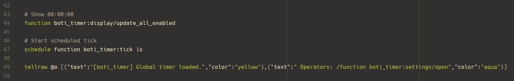

# Mcfunction Syntax Highlighting for Zed

Enhance Zed with mcfunction syntax highlighting!



## 🛠️ Development Setup

### 1. Clone the repository

```shell
git clone https://github.com/bcheidemann/zed-mcfunction
```

### 2. Uninstall the existing extension

If you have the existing extension installed, you need to uninstall it before installing the development version.

### 3. Load the extension

- Open `zed: extensions`.
- Click `Install Dev Extension`.
- Select the `zed-mcfunction` directory.

### 4. Rebuild the extension as needed

As you make changes to the extension, you may need to rebuild it. To do so:

- Open `zed: extensions`.
- Click the `Rebuild` button next to the extension.

## 🎸 Contributing

Contributions are welcome!

To contribute:

1. Fork the repo and create a new branch.
2. Make changes and test them.
3. Submit a pull request with a clear description.

Check open issues for areas needing improvement. Thanks for helping improve mcfunction support in Zed!

<a href="https://github.com/bcheidemann/zed-mcfunction/graphs/contributors">
  
</a>

## 🏆 Acknowledgments

- [@zarifpour](https://github.com/zarifpour) and the developers of [zed-env](https://github.com/zarifpour/zed-env), which this extension is forked from.
- [@IoeCmcomc](https://github.com/IoeCmcomc) for providing the [tree-sitter-mcfunction](https://github.com/IoeCmcomc/tree-sitter-mcfunction) repository.
